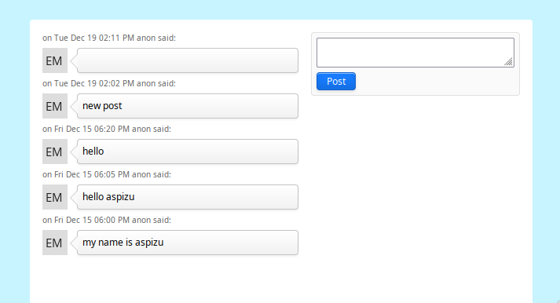

# Notesite

Notesite is a simple anonymous message board presented as a single-page app. Notesite
is built using [Flask](https://flask.palletsprojects.com/) and [Jixen](https://github.com/aspizu/jixen)



## Getting Started

These instructions will get you a copy of the project up and running on your local
machine for development and testing purposes. See [deployment](#deployment) for notes
on how to deploy the project on a live system.

### Prerequisites

* [Python](https://www.python.org/)
* [Flask](https://flask.palletsprojects.com/)
* [Jixen](https://github.com/aspizu/jixen)
* [Dart Sass](https://sass-lang.com/dart-sass)


### Installing

```sh
pip install flask
sudo pacman -S dart-sass
git clone https://github.com/aspizu/jixen
cat >> ~/.local/bin/jixen < EOF
#!/bin/bash
python $PWD/jixen/jixen "$@"
EOF
chmod +x ~/.local/bin/jixen
```

### Development

```sh
./devel.sh
```

## Deployment

TODO

## License

This project is licensed under the MIT License - see the [LICENSE.md](LICENSE.md) file
for details
